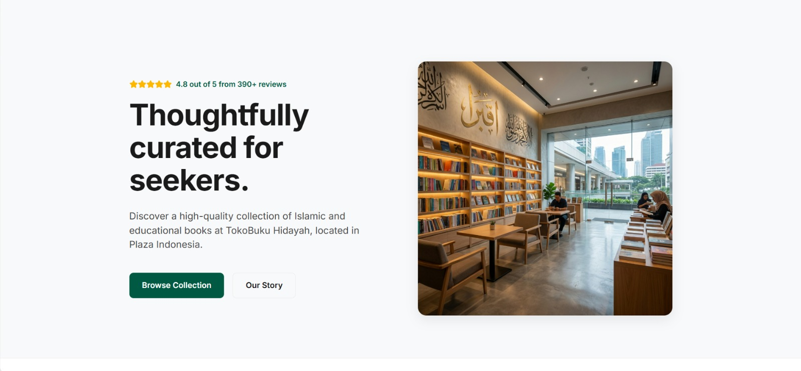

# Toko Buku Hidayah

Aplikasi Landing Page Toko Buku Sederhana yang terkonfigurasi ke WhatsApp. Proyek ini terdiri dari dua versi aplikasi:

1. **A_toko_buku**: Aplikasi Landing Page berbasis React + Vite.
2. **K_toko_buku**: Aplikasi Landing Page berbasis Next.js.

## Tampilan Aplikasi

Berikut adalah screenshot dari aplikasi Toko Buku Hidayah:

### Tampilan A


### Tampilan B


## Cara Menjalankan Aplikasi

### Versi React (A_toko_buku)
```bash
cd A_toko_buku
npm install
npm run dev
```

### Versi Next.js (K_toko_buku)
```bash
cd K_toko_buku
npm install
npm run dev
```
